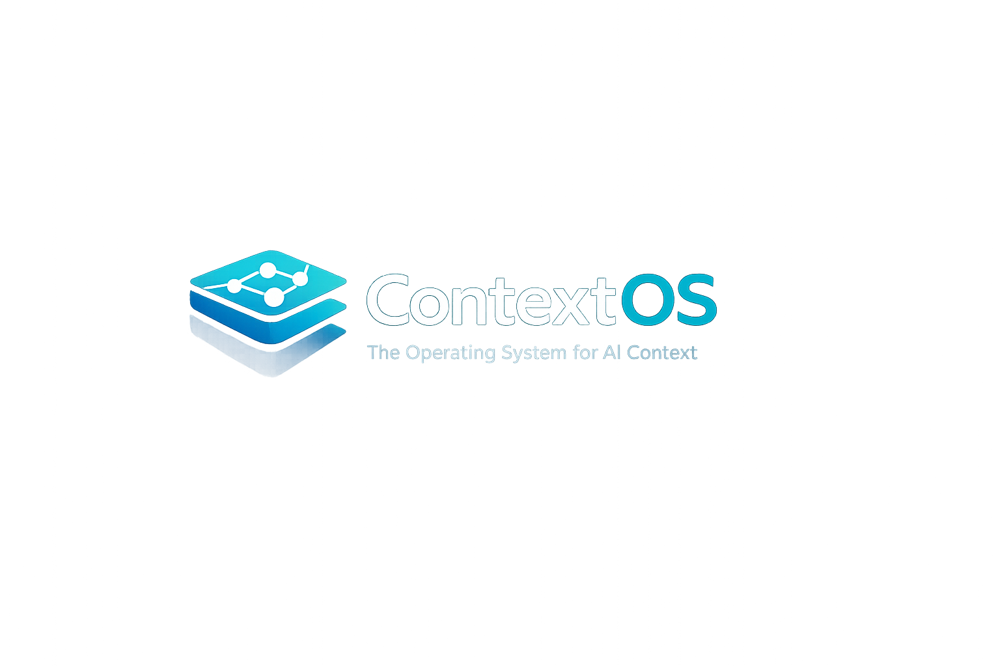

<div align="center">



# ContextOS

**La chaîne d'outils complète pour l'ingénierie de contexte LLM — linter, compiler, auditer, évaluer, corriger automatiquement, distribuer.**

[English](README.md) · **Français**

[](https://github.com/Jonathanlight/context_os/actions/workflows/ci.yml)
[](https://jonathanlight.github.io/context_os/)
[](https://pypi.org/project/context-os-ctx/)
[](https://www.python.org/downloads/)
[](LICENSE)

</div>

---

## Le problème

Un développeur travaillant sérieusement avec des LLM en 2026 maintient **5 à 10 fichiers de contexte** éparpillés dans des formats incompatibles :

```
votre-repo/
├── CLAUDE.md                          ← Claude Code
├── AGENTS.md                          ← Codex / Aider
├── .cursorrules                       ← Cursor
├── .cursor/rules/*.mdc                ← Cursor (nouveau format)
├── .clinerules                        ← Cline
├── .windsurfrules                     ← Windsurf
├── .github/copilot-instructions.md    ← GitHub Copilot
├── skills/<nom>/SKILL.md              ← Anthropic Skills
└── rag.ctx                            ← Config corpus RAG
```

Ils **divergent**. Ils **se contredisent**. Personne ne remarque que la règle `Always use type hints` dans `CLAUDE.md` contredit `Never use type hints in benchmarks` dans `.cursorrules`. Le modèle voit les deux ; l'une gagne ; le choix est invisible pour l'auteur.

## La solution

ContextOS traite le contexte LLM comme du **code source** : parsé en AST typé, validé contre 27 règles de lint, synchronisé entre cibles, évalué contre des LLM réels, corrigé automatiquement quand la transformation est sans ambiguïté.

```
   ┌─────────────────┐
   │  project.ctx    │   ← écrit une seule fois
   └────────┬────────┘
            │
   ┌────────▼─────────┐
   │   ContextOS      │   ← parse · lint · évalue · corrige
   └────────┬─────────┘
            │
   ┌────────┼────────┬────────┬────────┬─────────┐
   ▼        ▼        ▼        ▼        ▼         ▼
CLAUDE.md AGENTS.md cursor copilot windsurf  SKILL.md
                                              rag.manifest.json
```

## Ce qui est livré

|     | Capacité | Une ligne |
| --- | --- | --- |
| 📝 | **`ctx compile`** | Une source `.ctx` → huit formats cibles |
| 🔎 | **`ctx lint`** | 27 règles dans les catégories A / C / F / K / P / R / S / X / XA |
| 🌳 | **`ctx audit`** | Parcourt un repo, lint chaque fichier, détecte les collisions cross-artefacts |
| 📊 | **`ctx stats`** | Agrège les diagnostics au niveau du corpus + top codes |
| 🔀 | **`ctx diff`** | Diff sémantique entre deux versions de contexte |
| 🧪 | **`ctx eval`** | Évaluation fonctionnelle contre Anthropic Skills + retrieval RAG |
| 📉 | **`ctx eval-diff`** | Compare deux runs, bloque la CI sur régression |
| 🛠 | **`ctx fix`** | Applique automatiquement les fixes structurés (X003, F001, X001, S005) |
| 🧠 | **`ctx lsp`** | Serveur LSP pour VSCode / Neovim / Helix / Sublime |
| 📺 | **`--html`** | Rapports HTML autonomes pour audit + eval |

## Installation

> **Publication PyPI en attente** — la distribution `context-os-ctx` sur
> PyPI n'est pas (encore) le package de ce dépôt. Tant que la
> première release n'est pas publiée, installer depuis la source
> git. Voir [`docs/release.md`](docs/release.md) pour la
> configuration de la publication.

### Depuis la source git (recommandé aujourd'hui)

```bash
# CLI de base
pipx install git+https://github.com/Jonathanlight/context_os.git

# Avec support éditeur (LSP)
pipx install 'git+https://github.com/Jonathanlight/context_os.git#egg=context-os-ctx[lsp]'

# Avec évaluation (Anthropic + OpenAI + numpy)
pipx install 'git+https://github.com/Jonathanlight/context_os.git#egg=context-os-ctx[eval]'
```

Épingler une release spécifique avec `@vX.Y.Z` :

```bash
pipx install git+https://github.com/Jonathanlight/context_os.git@v4.0.0
```

### Une fois la publication PyPI configurée

```bash
pipx install context-os-ctx
pipx install 'context-os-ctx[lsp]'
pipx install 'context-os-ctx[eval]'
```

### Vérification

```bash
ctx --version
# contextos 4.0.0
```

## Tour de cinq minutes

### 1 — Écris ton contexte projet une seule fois

```toml
# project.ctx
project = "MonApp"
artifacts = ["context"]

[stack]
required = ["python>=3.12", "fastapi"]
forbidden = ["django"]

[[rules]]
id = "TDD-001"
title = "Écrire un test qui échoue avant tout changement de code de production"
severity = "must"
rationale = "Attrape les régressions avant la revue de PR."

[[rules]]
id = "SEC-042"
title = "Sanitiser toute entrée traversant une frontière de confiance"
severity = "must"
rationale = "Empêche les attaques par path-traversal et injection."
example_good = "bleach.clean(user_html)"
```

### 2 — Compile vers chaque cible

```bash
ctx compile project.ctx --target claude_code --output-dir .   # → ./CLAUDE.md
ctx compile project.ctx --target codex       --output-dir .   # → ./AGENTS.md
ctx compile project.ctx --target cursor      --output-dir .   # → ./.cursor/rules/agent.mdc
ctx compile project.ctx --target copilot     --output-dir .   # → ./.github/copilot-instructions.md
```

### 3 — Lint les fichiers existants

```text
$ ctx lint CLAUDE.md --target claude_code
warning[A001]: directive vague : 'Be concise'
  --> CLAUDE.md:42:1
   = help: reformule avec un critère mesurable (e.g. 'public functions
     <= 40 lines' au lieu de 'be concise')
   = doc:  https://contextos.dev/rules/A001

warning[K002]: la règle 'TDD-001' de sévérité must n'a pas de rationale
  --> CLAUDE.md:14:1
   = help: ajoute `rationale = "..."` expliquant pourquoi cette règle est obligatoire
```

### 4 — Audite un repo entier

```text
$ ctx audit .

--- ./CLAUDE.md
warning[F002]: titre de règle long de 145 caractères (limite : 120)
  --> ./CLAUDE.md:12:1

--- ./AGENTS.md
no diagnostics

--- Cross-artifact
warning[XA001]: l'id de règle 'TDD-001' entre en collision sur 2 fichiers avec
contenu différent : ['./AGENTS.md', './CLAUDE.md']

summary: 2 diagnostic(s)
```

### 5 — Évalue fonctionnellement tes skills

```bash
ctx eval skills.eval.toml --skills-dir skills/ --json --output current.json
ctx eval-diff baseline.json current.json
# exit 1 si un cas qui passait auparavant échoue maintenant
```

### 6 — Auto-correction de ce qui est sûr

```bash
ctx fix CLAUDE.md           # dry-run : affiche un diff unifié
ctx fix CLAUDE.md --apply   # écrit la correction
```

## Architecture

```
┌─────────────────────────────────────────────────────────────────┐
│                       ContextOS v4.0                            │
├─────────────────────────────────────────────────────────────────┤
│                                                                 │
│  ┌────────────────────────────────────────────────────────┐     │
│  │  AST (Pydantic v2, mypy --strict)                      │     │
│  │  Agent · Skill · RAG · Eval                            │     │
│  └────────────────────────────────────────────────────────┘     │
│                                                                 │
│  ┌────────────┬─────────────┬────────────┬────────────────┐     │
│  │  Parsers   │  Analyzers  │  Emitters  │  Runners eval  │     │
│  │  .ctx      │  27 règles  │  8 cibles  │  Anthropic     │     │
│  │  CLAUDE.md │  A/C/F/K/P/ │  Markdown  │  OpenAI        │     │
│  │  SKILL.md  │  R/S/X/XA   │  JSON      │  Mock          │     │
│  └────────────┴─────────────┴────────────┴────────────────┘     │
│                                                                 │
│  ┌────────────────────────────────────────────────────────┐     │
│  │  Surfaces                                              │     │
│  │  CLI · Bibliothèque Python · Serveur LSP · Extension   │     │
│  │      VSCode · GitHub Action · Rapports HTML            │     │
│  └────────────────────────────────────────────────────────┘     │
│                                                                 │
└─────────────────────────────────────────────────────────────────┘
```

Trois familles d'artefacts : **fichiers de contexte agent** · **Anthropic Skills** · **corpus RAG**.
Trois modes opératoires : **lint structurel** · **évaluation fonctionnelle** · **auto-correction**.
Cinq surfaces de consommation : **CLI** · **Bibliothèque Python** · **LSP** · **Extension VSCode** · **GitHub Action**.

## Cibles supportées

| Cible             | Parse | Emit | Nom de fichier                        |
|-------------------|:-----:|:----:|---------------------------------------|
| `claude_code`     |  ✅   |  ✅  | `CLAUDE.md`                           |
| `codex`           |  ✅   |  ✅  | `AGENTS.md`                           |
| `cursor`          |  ⏳   |  ✅  | `.cursor/rules/agent.mdc`             |
| `copilot`         |  ⏳   |  ✅  | `.github/copilot-instructions.md`     |
| `cline`           |  ⏳   |  ✅  | `.clinerules`                         |
| `windsurf`        |  ⏳   |  ✅  | `.windsurfrules`                      |
| `anthropic_skill` |  ✅   |  ✅  | `SKILL.md`                            |
| `rag_manifest`    |  N/A  |  ✅  | `rag.manifest.json`                   |

## Référence CLI

| Commande             | Rôle                                                                 |
|----------------------|----------------------------------------------------------------------|
| `ctx parse`          | `.ctx` / Markdown / SKILL.md → AST en JSON ou TOML                   |
| `ctx compile`        | `.ctx` → fichier cible (8 cibles supportées)                         |
| `ctx lint`           | Lance les 27 analyseurs sur un fichier                               |
| `ctx diff`           | Diff sémantique au niveau de l'AST entre deux Documents              |
| `ctx audit`          | Parcourt un repo, lint tout, applique les règles cross-artefacts     |
| `ctx stats`          | Agrège les statistiques au niveau du corpus depuis un audit          |
| `ctx lsp`            | Serveur LSP sur stdio (nécessite l'extras `[lsp]`)                   |
| `ctx eval`           | Lance un `.eval.toml` contre un provider réel ou mock                |
| `ctx eval-diff`      | Compare deux sorties `ctx eval --json` ; exit 1 sur régression       |
| `ctx fix`            | Applique les fixes structurés ; `--dry-run` défaut, `--apply` écrit  |

**Flags universels :** chaque commande accepte `--json` pour une sortie machine-readable.
**Rapports HTML :** `ctx audit --html` et `ctx eval --html` produisent du HTML autonome.
**Codes de sortie :** 0 en succès, 1 uniquement quand un diagnostic de sévérité error se déclenche (ou qu'une erreur structurelle survient).

## État du projet

| Phase | Contenu                                                       | Statut     |
|-------|---------------------------------------------------------------|------------|
| 1     | Parser + AST + emitter Claude                                 | ✅ livré   |
| 2     | 15 règles de lint (A / C / F / K / P / X / XA)                | ✅ livré   |
| 3     | 5 emitters supplémentaires + diff + audit                     | ✅ livré   |
| 4     | Stats de corpus + site docs + lancement **v1.0**              | ✅ livré   |
| 5     | Anthropic Skills (`SKILL.md`) + 6 règles skill                | ✅ livré   |
| 6     | Corpus RAG + 6 règles RAG + lancement **v2.0**                | ✅ livré   |
| 7A    | Serveur LSP + extension VSCode + GitHub Action + **v2.1**     | ✅ livré   |
| 7B    | Évaluation live (Skills + RAG) + lancement **v3.0**           | ✅ livré   |
| 8     | PyPI/Marketplace + rapports HTML + `ctx fix` + lancement **v4.0** | ✅ livré |
| 9+    | Skills multi-provider, helpers d'embedding, PDF en RAG, …     | ⏳ prévu   |

## Intégration éditeur

ContextOS parle LSP et fournit une extension VSCode.

```bash
pipx install 'git+https://github.com/Jonathanlight/context_os.git#egg=context-os-ctx[lsp]'
```

- **VSCode** — extension dans [`extensions/vscode/`](extensions/vscode).
- **Neovim / Helix / Sublime** — configs client LSP de trois lignes dans [`docs/editor.md`](docs/editor.md).
- **CI GitHub** — Action composite dans [`actions/lint/`](actions/lint) :
  ```yaml
  - uses: Jonathanlight/context_os/actions/lint@v4.0.0
  ```
  Poste un commentaire sticky de rapport d'audit sur la PR.

Les 27 règles, l'autocomplétion, le hover, et les quick-fixes se comportent identiquement partout — l'éditeur n'est qu'une fenêtre alternative sur le même cœur Python.

## Évaluation live

Passer de la validation **structurelle** à la validation **fonctionnelle** : le skill se déclenche-t-il vraiment sur les bons prompts ? Le retrieval RAG trouve-t-il vraiment les sources attendues ?

```bash
pipx install 'git+https://github.com/Jonathanlight/context_os.git#egg=context-os-ctx[eval]'

ctx eval skills.eval.toml --dry-run             # smoke en mock, aucun appel API
ctx eval skills.eval.toml --skills-dir skills/  # run réel Anthropic
ctx eval-diff baseline.json current.json        # exit 1 sur régression
```

- **Routing des skills** via la feature tool-use de l'API Messages d'Anthropic (`ANTHROPIC_API_KEY`).
- **Retrieval RAG** via cosine in-process sur embeddings pré-indexés (`OPENAI_API_KEY` pour l'embedding de la query ; bring-your-own via l'API Python pour les autres vendeurs).
- **Providers mock** font tourner chaque test en CI sans dépenser de tokens.

Voir [`docs/eval.md`](docs/eval.md) pour le workflow complet.

## Visualisation & auto-correction

```bash
ctx audit . --html --output audit.html
ctx eval skills.eval.toml --dry-run --html --output eval.html
ctx fix CLAUDE.md          # dry-run diff unifié
ctx fix CLAUDE.md --apply  # écrit les corrections
```

Voir [`docs/dashboard.md`](docs/dashboard.md).

## Docs

- 📚 [Site de documentation](https://jonathanlight.github.io/context_os/)
- 🛠 [Pour commencer](docs/getting-started.md)
- 🧠 [Intégration éditeur](docs/editor.md)
- 🧪 [Évaluation live](docs/eval.md)
- 📺 [Visualisation & auto-fix](docs/dashboard.md)
- 📦 [Publication d'une release](docs/release.md)
- 📋 [Catalogue de règles](docs/rules/index.md)
- 🏛 [Specs](docs/specs/) (Vision · Spec · Architecture · Roadmap)

## Stack technique

- **Python 3.12+**, `mypy --strict` clean sur chaque fichier.
- [Pydantic v2](https://docs.pydantic.dev) — AST strict typé.
- [Typer](https://typer.tiangolo.com) — la CLI `ctx`.
- [mistletoe](https://github.com/miyuchina/mistletoe) — parser Markdown.
- [tomlkit](https://github.com/python-poetry/tomlkit) — TOML qui préserve commentaires + ordre.
- [ruamel.yaml](https://yaml.readthedocs.io) — YAML qui préserve commentaires + ordre (frontmatter SKILL.md).
- [pygls](https://github.com/openlawlibrary/pygls) (optionnel) — serveur LSP.
- [anthropic](https://docs.anthropic.com), [openai](https://platform.openai.com), [numpy](https://numpy.org) (optionnels) — runtime eval.
- pytest + [hypothesis](https://hypothesis.readthedocs.io) — **1129 tests**, 94 % de couverture, 1000 exemples property tests sur le round-trip.
- [ruff](https://docs.astral.sh/ruff/) — lint + format.

## Installation pour le développement

```bash
git clone git@github.com:Jonathanlight/context_os.git
cd context_os
pip install -e ".[dev]"
pre-commit install
./scripts/check.sh    # ruff + mypy --strict + pytest
```

Pour le site docs :

```bash
pip install -e ".[docs]"
mkdocs serve   # http://127.0.0.1:8000/
```

## Contribuer

Les pull requests sont bienvenues. Lire [`tasks/CONTRIBUTING.md`](tasks/CONTRIBUTING.md) d'abord — ContextOS impose une discipline stricte (un sujet par PR, ≤ 400 lignes de diff hors tests, commits conventionnels préfixés par phase).

## Licence

MIT — voir [LICENSE](LICENSE).

## Auteur

[Jonathan KABLAN](https://github.com/Jonathanlight) — Senior Full Stack Developer.
